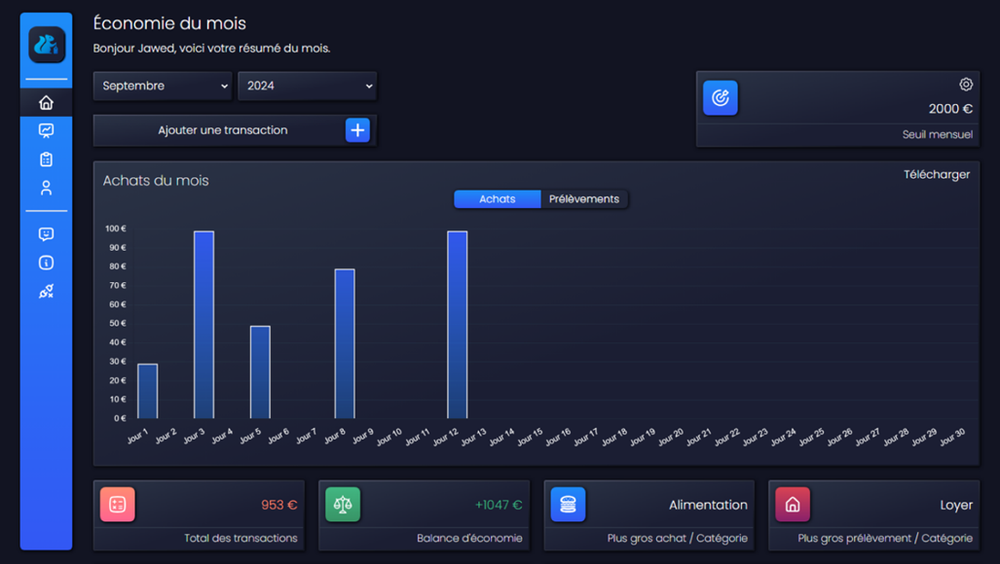

# Squirrel Stash

## Description
SQUIRREL STASH est une application dédiée à la gestion des économies personnelles. Elle est conçue pour offrir à chaque utilisateur une manière intuitive et efficace de suivre ses dépenses.

L'application est facilement accessible sur divers appareils, permettant une gestion des finances à tout moment et en tout lieu. 
Son interface dynamique garantit une expérience utilisateur fluide, rendant le suivi des dépenses à la fois simple et agréable.

## Fonctionnalités

1.	Authentification des utilisateurs 
2.	Consultation des statistiques 
3.	Gestion des transactions 
4.	Filtrage des transactions selon les paramètres de recherche 
5.	Dynamisme et responsive 
6.	Téléchargement des graphiques 
7.	Accessibilité des overlays / formulaires
8.	Support utilisateur 

## Technologies

- Frontend: Vue.js, tailwind
- Backend: PHP, MySQL, MVC
- Environnement: Vite, API Rest, Token JWT