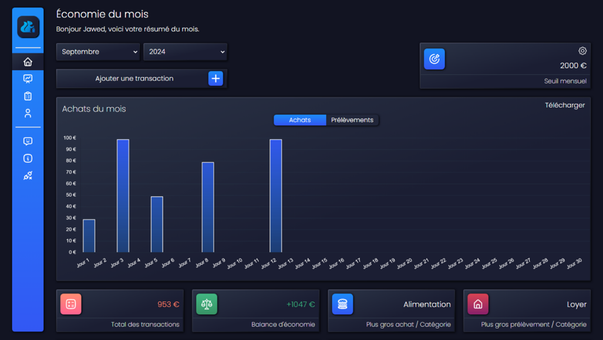

# Squirrel Stash

## Installation

### 1. Cloner le dépôt
- HTTPS : `https://github.com/Jawed-Dev/Squirrel-Stash.git`
- SSH : `git@github.com:Jawed-Dev/Squirrel-Stash.git`
- CLI : `gh repo clone Jawed-Dev/Squirrel-Stash`

### 2. Configuration de la base de données
Une fois les dépendances installées, importez le fichier `db.sql` situé dans le dossier `backend` du projet pour créer la structure de la base de données MySQL.

### 3. Installation des dépendances
- Accédez au dossier `frontend` pour installer les dépendances Vue.js via NPM.
- Accédez au dossier `backend` pour installer les dépendances PHP via Composer.

### 4. Configuration du fichier .env
- Modifiez le fichier `.env` dans le dossier `backend` et configurez les clés nécessaires.

## Description

`SQUIRREL STASH` est une application dédiée à la gestion des économies personnelles. Elle est conçue pour offrir à chaque utilisateur une manière intuitive et efficace de suivre ses dépenses.

L'application est facilement accessible sur divers appareils, permettant une gestion des finances à tout moment et en tout lieu. Son interface dynamique garantit une expérience utilisateur fluide, rendant le suivi des dépenses à la fois simple et agréable.

## Fonctionnalités

1. Authentification des utilisateurs
2. Consultation des statistiques
3. Gestion des transactions
4. Filtrage des transactions selon différents paramètres
5. Interface dynamique et responsive
6. Téléchargement des graphiques
7. Accessibilité des overlays et des formulaires
8. Support utilisateur

## Technologies

- Frontend : Vue.js, Tailwind
- Backend : PHP, MySQL, architecture MVC
- Environnement : Vite, API Rest, Token JWT pour l'authentification

## Crédits
- Icônes : [Tabler Icons](https://tabler.io/icons)
- Logo : [Canva](https://www.canva.com/design/DAGQRU6vWcs/0cfrsfTg6hXx7yvw7CYqzQ/edit)
